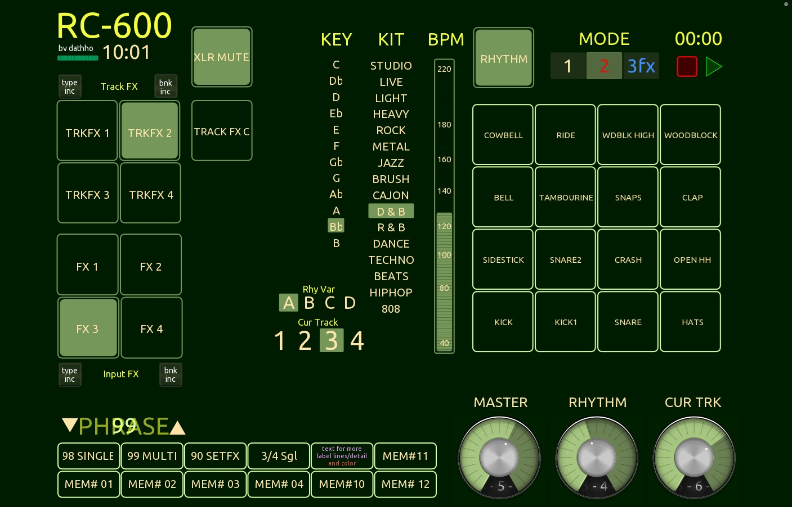

# GreenRC
A touchOSC document for the BOSS RC-600 6-channel looper.

    __NEW__  updated gig timer.  It can now count up or down (from 45 min) in the same footprint.  Press the reset when paused for settings UP:DN to select. DN when 00:00 will set for 45 min. Radio button "Time Down Selector" popup almost working to select 15-90 min count down time. Probably some bugs.

This version trades the ASSIGN selecting tracks 5&6, for a tempo slider.
A TAP TEMPO on the interface didn't work for me, but I like this. It's not accurate on some Genre's so it will probably go away.  I think I know why and it could be prgramatically adjusted.  I tap tempo, at times I've had an FS-7 do BPM inc/dec, but even with that my timing's bad.  Comment in the forums or discussion here.
Things were tightened up and beautified.

1. __Instructions are in the Document notes:__ they may not be as updated-this is easier.
2. Designed for use with the __BOSS RC-600__.  
3. __MIDI Channel 1__
4. __PEDAL MODE may need to be set to INC__  I set SYSTEM Pedal Prefs to MEMORY for MODE 1, 2, and 3. 
5. __ASSIGNS__ are required on the Boss RC600 for functionality.  Place the MEMORY99A.RC0 and MEMORY98A.RC0 on your looper and copy their Assigns to other locations...  Copy MEMORY90A.RC0 and select that PHRASE to get the FX inc buttons.
6. MEMORY90X.RC0 is for sampling, testing, and setting effects chains. Little else will work when that PHRASE is loaded.
     Once you are happy with the chain and settings save 90 and copy the effects, rhythm, pedal settings,  to the phrase(s) you want.
7. __NOTE__ most of my PHRASES have all six tracks set RC-5 style (TRKn REC/PLAY 4) on MODE 1, with effects and various other things in the other MODE(s).  I reccomend you get a MODE setup you like and keep it the same.

 If you must set your own ASSIGNS, at least get https://www.rc600editor.com/, and scroll your life away. The RC-600 has nearly 3 pdf pages of possible assigns not including the IN & TRK 4 banks of 4 effects, foreach of 6 tracks. each of which can be 1 of 57 effects.  There are 4 ways to set the START and STOP of everything. Gets a little complicated after a while. At least with Moose's tool you can do it standing up. 1 number off, or slightly wrong target, there's no telling what you might end up with. The MEMORYXXA.RC0 files are provided to drop on your looper so you don't have to set them yourself. Still, you should use RC-Editor to checkk them.
    
  __-- Subject To change --__  README may not keep up but the RC0 files should.

| ASSIGN | CC Source | Target           |
|--------|-----------|------------------|
|  1     |  01       | RHYTHM ST/STOP   |
|  2     |  02       | RHYTHM KIT       |
|  3     |  03       | RHYTHM LVL       |
|  4     |  04       | MASTER LVL       |
|  5     |  15       | IN FX A          |
|  6     |  06       | PEDAL MODE       |
|  7     |  17       | IN FX C          |
|  8     |  18       | IN FX D          |
|  9     |  09       | IN FX A PRM4     |
|  10    |  16       | IN FX B          |
|  11    |  20       | MIC1 IN MUTE     |
|  12    |  12       | RHYTHM VAR       |
|  13    |  13       | CUR TRK LVL      |
|  14    |  14       | CUR TRK NUM 1+2  |
|  15    |  20       | CUR TRK NUM 3+4  |
|  16    |  21       | TEMPO            |

### For MEMORY90A.RC0

| ASSIGN | CC Source | Target           |
|--------|-----------|------------------|
|  1     |  64       | T FX CR TYP INC  |
|  2     |  65       | RHYTHM LVL       |
|  3     |  66       | MASTER LVL       |
|  4     |  67       | IN FX CR TYP INC |
|  5     |  68       | PEDAL MODE       |
|  6     |  69       | IN FX A          |
|  7     |  70       | IN FX B          |
|  8     |  71       | IN FX C          |
|  9     |  72       | IN FX D          |
|  10    |  73       | IN FX A PRM4     |
|  11    |  74       | IN FX BNK INC    |
|  12    |  75       | TRK FX A         |
|  13    |  76       | TRK FX B         |
|  14    |  77       | TRK FX C         |
|  15    |  78       | TRK FX D         |
|  16    |  79       | TRK FX BNK INC   |

# FEATURES
This touchOSC Document incorporates nearly every working example of "cool" touchOSC/lua stuff I could find and make to work over Christmas 2025.  If you want to learn those things like I did, it might be a place to start. Follow this repository to see commits.  Great, and very functional, updates to the timer coming I hope. I just couldn't make them work like I want yet.

* Shiny Radial Faders, There is a "dialed down" version. most of which is there but hidden and only 1 version will be available.  There could be a button to switch one day, but I don't think it's that important to try and support crappy hardware.  TRK 5&6 are just hidden and disabled so could be traded on and off for BPM.
* Battery, Clock, and Gig Timer.
* KEY Select is for Manual Vocal effects +3, +5, octave and unison on IN FX 1-4 that are applied only to MIC1 and not recorded on TRK 1-3 on MEM 98,99.  (Most all my PHRASES are set this way) 
* Only IN effects buttons are active on all but 90. (See below) 
* Slider, up/down, preset memory/phrase selector. PROGRAMCHANGE is one thing that comes from the looper but not if you use the knob, only a pedal.  However, it's not handled correctly and will mess up the slider if receive is enabled.
* TRK SEL
* Pads, KIT, Rhythm Var.  Genre and Pattern have to be picked up from the PHRASE.  These can be switched per mem/loop/track but you can't access them remotely. 
* #MEM 90 is to audition and set effects chains. On the other set of ASSIGNS, the inc and TRK FX buttons will not be active. Scroll to the appropriate screen on the RC-600 to show them and you can cycle through bank and type and turn them on and off easily.  Get what you like. Save 90. Thenn copy it's effects (THANK YOU! JMT) to other places.  Don't mess up IN Bank A! or the other parts of your PHRASES.  Set RHYTHM, mixer, IN/OUT trk stuff, etc.

__I'm looking for your best MEMORYXXA.RCO examples.  Maybe with a great pedal mode setup you like and why.  Great rhythm setups or effects chains....__
  I'm struggling to get a decent Waltz I like.

Next Up: 
  * 3D, touch sensitive PADs.  Right now I don't see a path but I'm on the outlook. Will the accelerometer work?  Let me know if you can help!
  * __✔__ up/down gig timer in the same footprint.
    * with 15-90 minute "tm dn select" popup radio. 
  * Additional pages (tabs) to display RC status from a synced backup.
    1. system

          pedals, prefs,,,
    2. phrase/loop

          pedals, assigns,status,prefs,,,
    3. track

         routing and mixer, effects,,,

__Will listen to any ideas to make this better.__

It's Green so as not to be too bright onstage.

